# CarInfomation
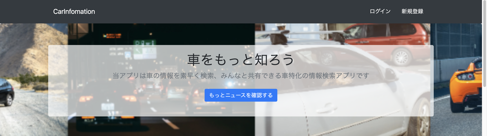
# URL
https://carinfomation-1188e7c8a511.herokuapp.com/
# サービス概要
車の情報収集にフォーカスしたアプリになります。記事をブックマークする機能、コメント機能、メーカー名での絞り込み、記事の検索機能を備えています。また、アクセス数、コメント数、ブックマーク数に応じたランキングの表示ができるようになっており、人気のある記事が把握しやすくなっています。
# 機能一覧
・新規登録機能

・ログイン、ログアウト機能

・ゲストログイン機能

・ブックマーク機能

・コメント機能

・アクセスランキング機能

・ブックマークランキング機能

・コメントランキング機能

・記事の検索機能

・キーワード検索機能

# 機能詳細
| トップ画面 | 各ランキング |
| ---- | ---- |
|  | 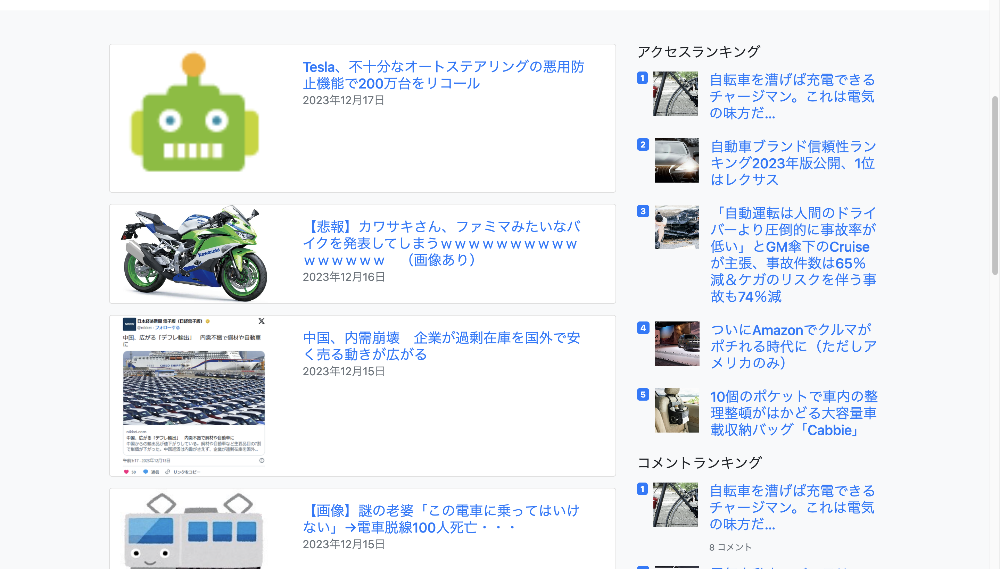 |
| 新着記事が日付の降順に表示されます。「もっとニュースを確認する」ボタンを押すことで記事一覧画面に遷移し、より多くの記事を見ることができます。また、画面右にアクセス数、ブックマーク数、コメント数に応じたランキングが表示されます。 | 下にスクロールした時の画面です。記事の右隣に各ランキングが表示されます。|

| 記事一覧画面 | コメント&ブックマーク(ログインあり) |
| ---- | ---- |
|  | 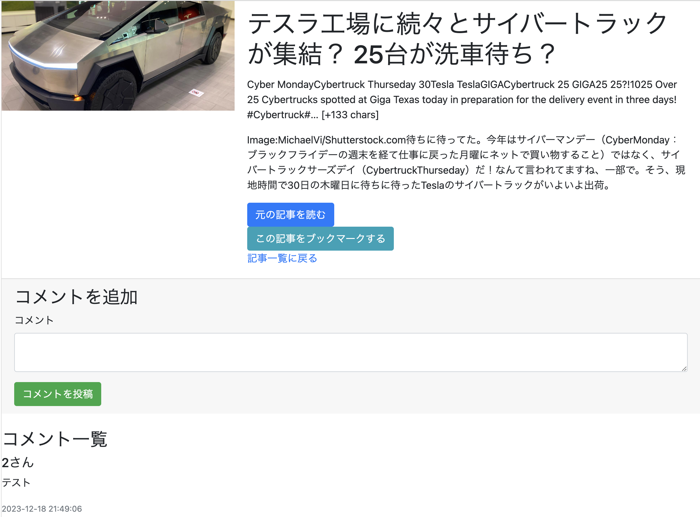 |
| 現在取得された記事の一覧が表示されます。左上の検索を使用することで、入力されたキーワードに沿った記事を抽出して表示することができます。また、メーカーごとにボタンが用意されており、各種クリックすることでメーカーに関連のある記事を絞り込むことができます。「詳細はこちら」をクリックすると記事の詳細画面に遷移します。 | 記事の詳細画面にて、ブックマーク登録、記事へのコメントを残すことができます。「元の記事を読む」ボタンを押すと、元記事のURLに遷移することができます。 |

| コメントの管理(ログインあり) | コメントの管理(２) |
| ---- | ---- |
| 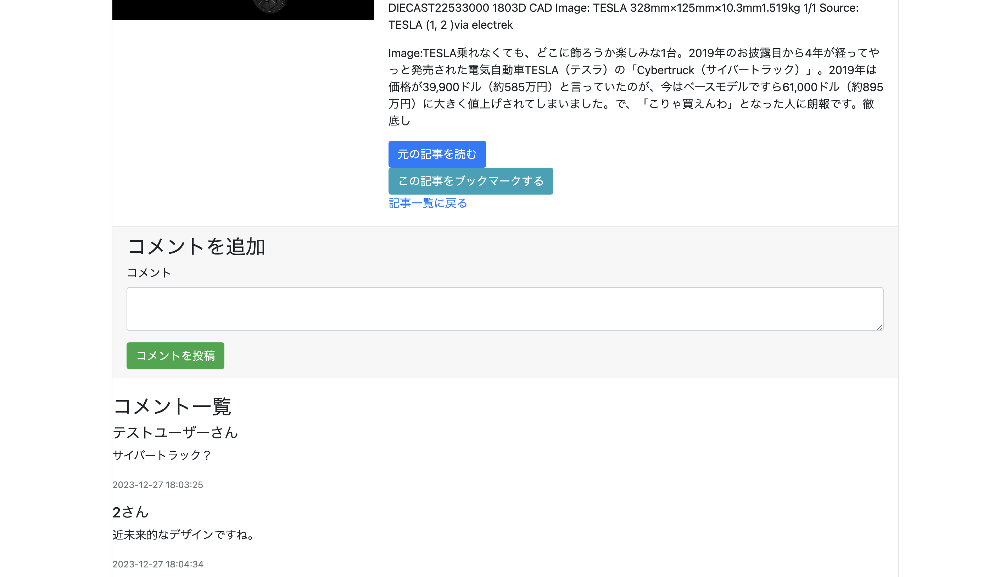 |  |
| 投稿したコメントは記事の下に表示されます。 | コメントを削除したい時や、今までのコメントを見返したい際はヘッダーの「コメント投稿一覧」をクリックしてください。 |

| コメントの管理(３) |
| ---- | 
| 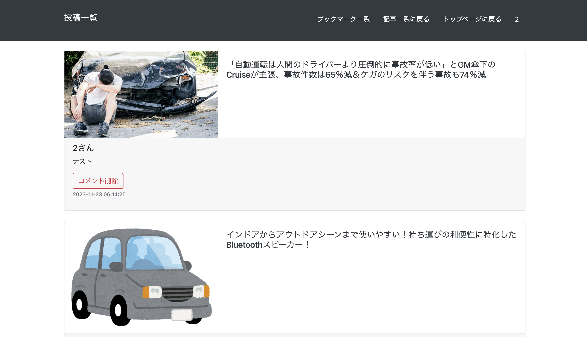 | 
| ここではこれまでにコメントした全てが表示されます。「削除」を押すことでコメントを削除することができます。 |

| ブックマークの管理(ログインあり) | ブックマークの管理(２) |
| ---- | ---- | 
| 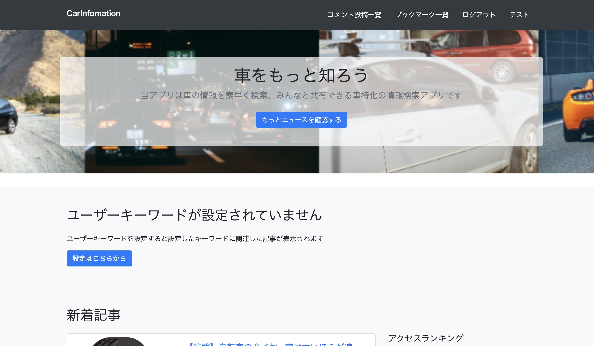 | 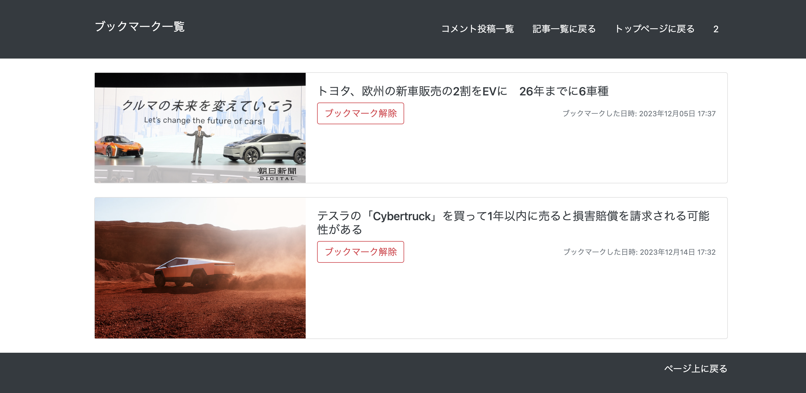  |
| 記事詳細画面でブックマーク登録をすると、ヘッダーのブックマーク一覧で記事を見返すことができるようになります。「ブックマーク一覧」をクリックします。 | クリックするとこれまでにブックマークした記事が表示されます。「ブックマーク解除」をクリックすることでブックマークを削除できます。 |

| ユーザーキーワード機能(ログインあり) | ユーザーキーワード設定画面（１） |
| ---- | ---- |
| 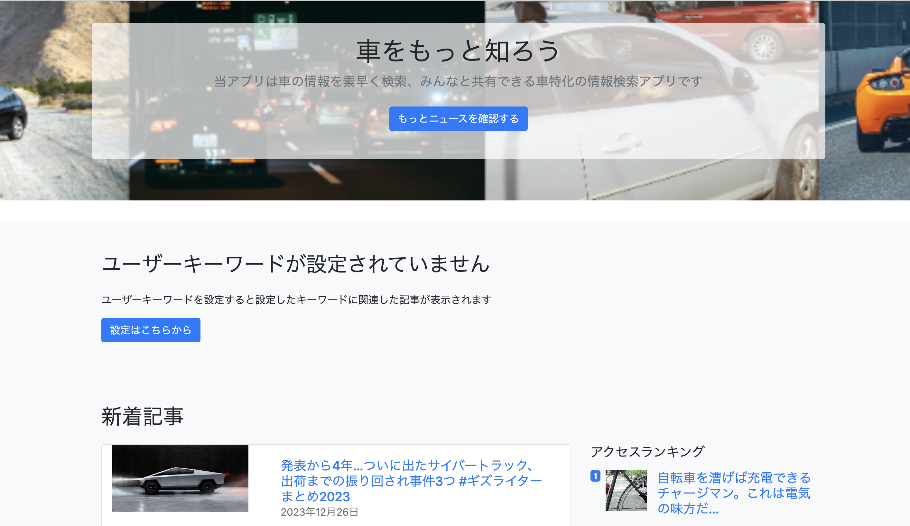 | 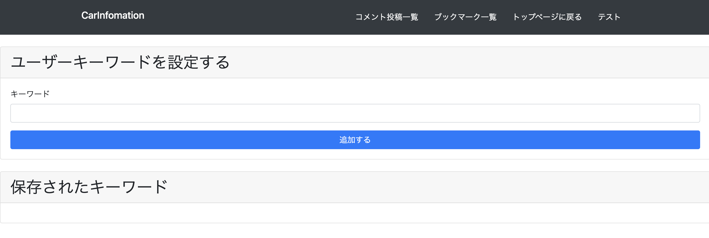 |
| ログインするとトップ画面にユーザーキーワードを設定する表示が出てきます。これは設定したキーワードに応じた最新の記事をトップ画面に表示させることができる機能になります。「設定はこちら」のボタンを押してみましょう。 | ボタンを押すと設定画面に遷移します。キーワードに適当な文字を入れ、「追加する」のボタンを押すとキーワードが保存されます。 |

| ユーザーキーワード設定画面（２）| ユーザーキーワード設定画面（３） |
| ---- | ---- |
| 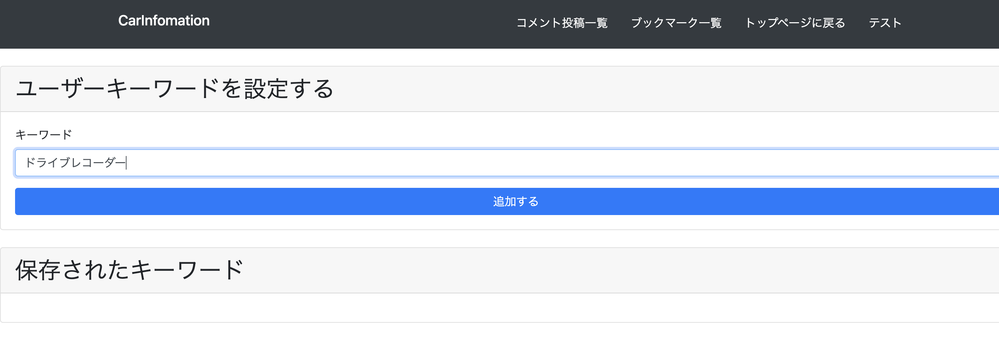 | 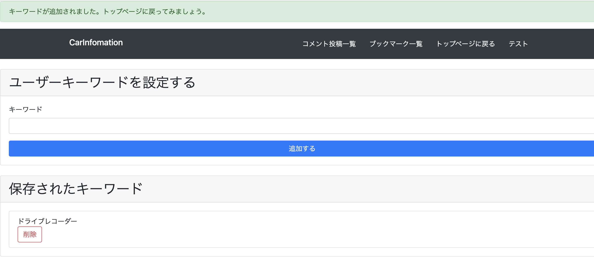 |
| 今回は「ドライブレコーダー」と入力してみます。「追加する」ボタンを押すと・・ | キーワードが保存され、画面上部にメッセージが出てきました。言葉に従い、トップページに戻ってみます。また、キーワードは3つまで追加できます。 |

| ユーザーキーワード設定画面（４）| ユーザーキーワードの削除（１） |
| ---- | ---- |
| 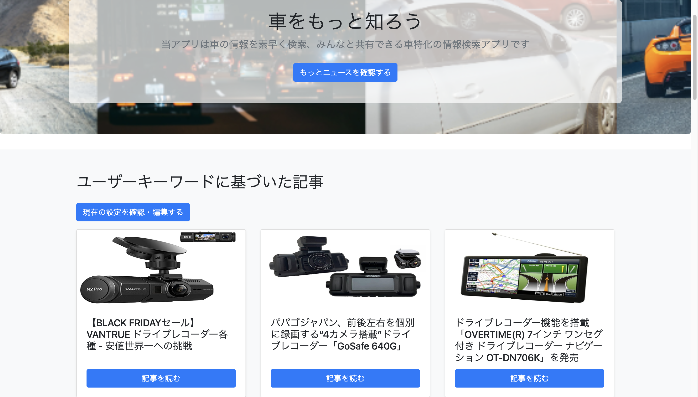 | 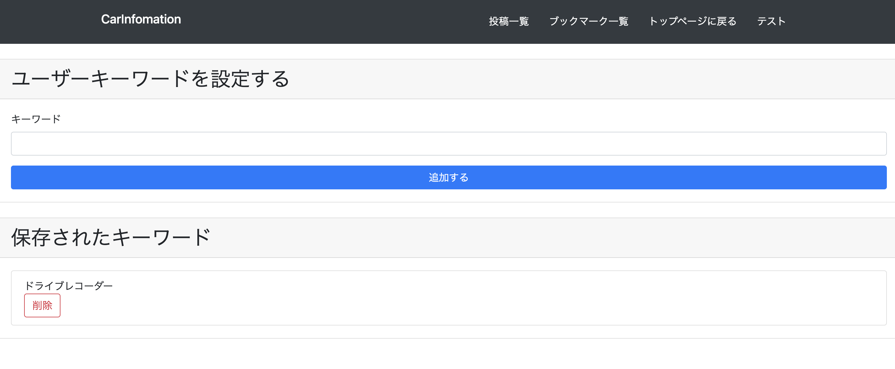 |
| トップ画面にユーザーキーワードに基づいた記事としてドライブレコーダーに関連のある記事が表示されました。このようにあらかじめ自分の興味のある事柄を設定しておくことで、アプリを開いた時に素早く自分の求める情報を手にいれることができます。記事は6つまで表示させることができます。ユーザーキーワードを削除する際は、「現在の設定を確認・編集する」ボタンを押します。 | 保存されたキーワード」の下に現在設定されているキーワードが出てきます。「削除」を押します。  |

| ユーザーキーワードの削除（２）|
| ---- | 
| 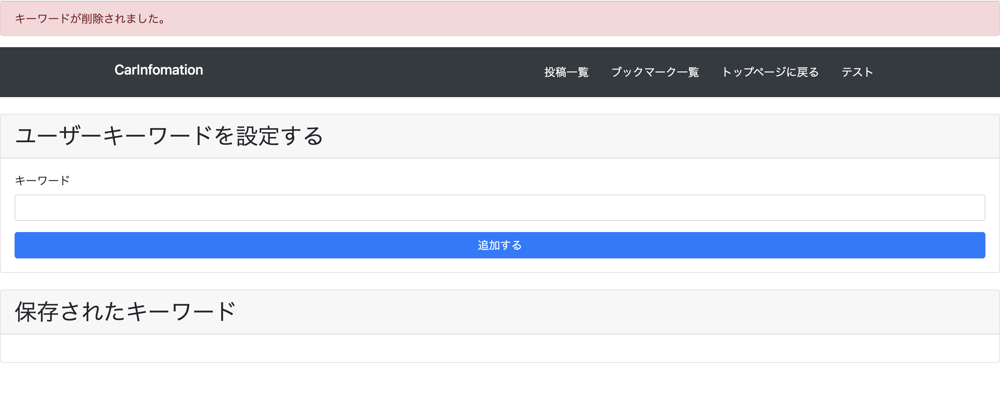 | 
| キーワードが削除されました。 | 

# 使用技術について
・Ruby on Rails 7.0.8
・News API

# 苦労した点
News APIで記事ごとにidを付加させることが上手く出来ず苦労しました。
また、開発時点で最新のバージョンのrailsを使用したため、6以前とは違う挙動を示すコードがあり対処に苦労しました。ただ、ゆくゆくはバージョンが入れ替わっていくことを考えると良い経験になったのではないかと感じています。

# インフラ図
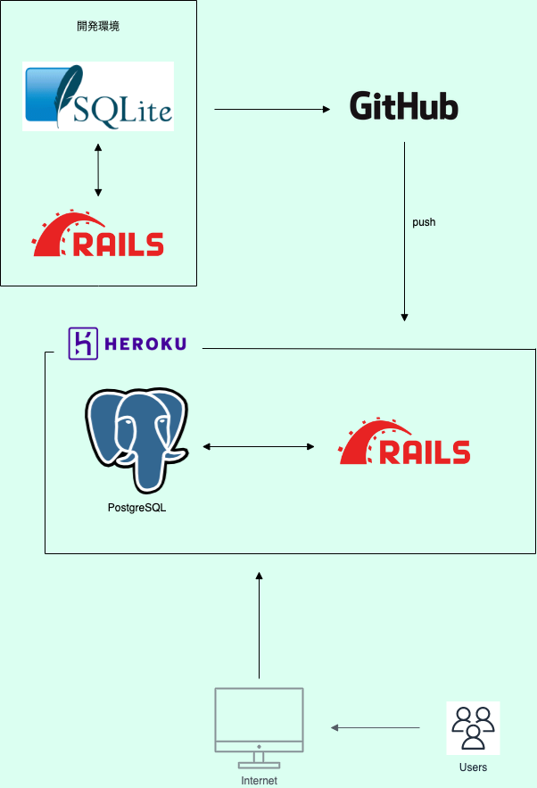

# ER図
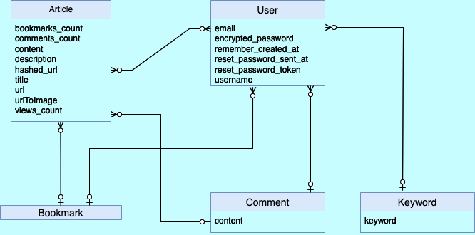

# 制作理由
友人が車の免許の取得中であり、兼ねてから車の情報を得るために今までGoogleニュースを使用していたものの、検索である程度絞れても全く関係ない記事が多く出て車のカテゴリの検索結果を出すのに時間がかかるため、最初からあらかじめ車の記事が中心に集まっており、なおかつ検索でより絞り込みやすい記事サイトがあると便利ということを聞き、アプリの制作に至りました。
