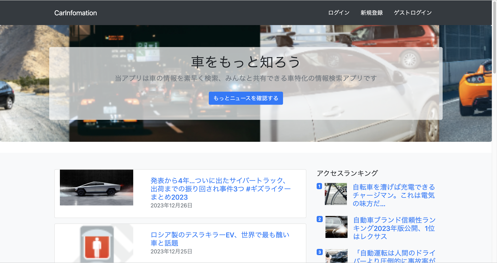
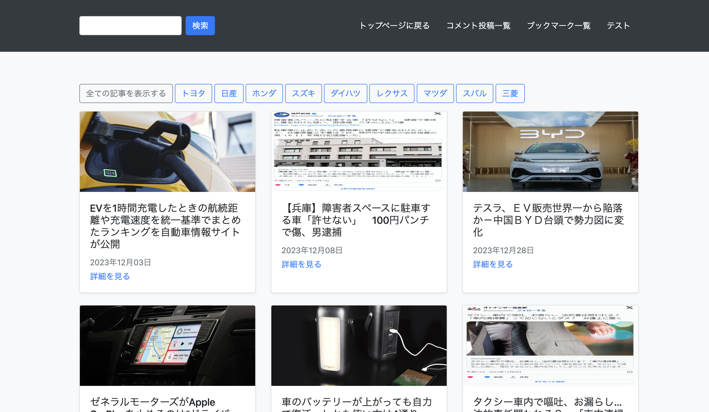

# CarInfomation

# URL
https://carinfomation-1188e7c8a511.herokuapp.com/
# サービス概要
車の情報収集にフォーカスしたアプリになります。
# 機能紹介
| トップ画面 | 各ランキング |
| ---- | ---- |
|  |  |
| 新規の記事が上から表示されます。青いボタンを押すことで記事一覧画面に遷移し、より多くの記事を見ることができます。 | トップ画面には最新の記事が日付の降順に並び、アクセス数、ブックマーク数、コメント数に応じた記事のランキングが表示されます。 |

| 記事一覧 | コメント&ブックマーク(ログインあり) |
| ---- | ---- |
|  |  |
| 現在取得された記事の一覧が表示されます。左上の検索を使用することで、入力されたキーワードに沿った記事を抽出して表示することができます。 | 記事の詳細画面にて、ブックマーク登録、記事へのコメントを残すことができます。元の記事へ遷移することも可能です。 |
# 使用技術について
・Ruby on Rails 7.0.8
・News API

# 苦労した点
News APIで記事ごとにidを付加させることが上手く出来ず苦労しました。
また、開発時点で最新のバージョンのrailsを使用したため、6以前とは違う挙動を示すコードがあり対処に苦労しました。ただ、ゆくゆくはバージョンが入れ替わっていくことを考えると良い経験になったのではないかと感じています。

# インフラ図

# ER図

# 制作理由
友人が車の免許の取得中であり、兼ねてから車の情報を得るために今までGoogleニュースを使用していたものの、検索である程度絞れても全く関係ない記事が多く出て車のカテゴリの検索結果を出すのに時間がかかるため、最初からあらかじめ車の記事が中心に集まっており、なおかつ検索でより絞り込みやすい記事サイトがあると便利ということを聞き、アプリの制作に至りました。
